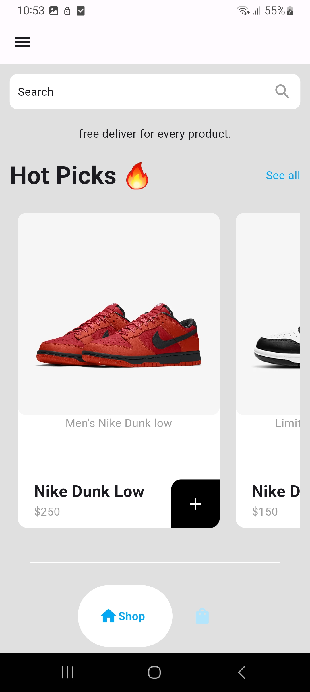
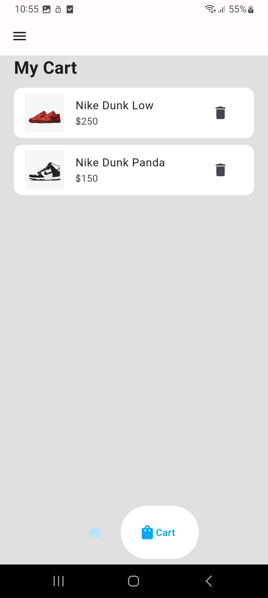

# ecom
# Simple E-Commerce App

A new Flutter project.
This is a simple e-commerce app built with Flutter. The app allows users to browse a list of items, add them to the cart, and remove them as needed. It utilizes the **Provider** package for state management in a straightforward and minimalistic way.

## Getting Started
## Features
- View a list of available items.
- Add items to the cart.
- Remove items from the cart.
- Responsive and simple UI.

## State Management
The app uses **Provider** for managing the state, particularly for tracking the items in the cart. Provider simplifies the state handling across different parts of the app.

This project is a starting point for a Flutter application.
## Screenshots
Below are some screenshots of the app:

A few resources to get you started if this is your first Flutter project:
<table>
  <tr>
    <th>Intro Page</th>
    <th>Shop Page</th>
    <th>Shop Page</th>
     <th>Adding to Cart</th>
   <th>Cart page</th>
    <th>Drawer</th>
  </tr>
  <tr>
    <td></td>
    <td></td>
    <td></td>
    <td></td>
    <td></td>
    <td></td>
  </tr>
</table>

- [Lab: Write your first Flutter app](https://docs.flutter.dev/get-started/codelab)
- [Cookbook: Useful Flutter samples](https://docs.flutter.dev/cookbook)

For help getting started with Flutter development, view the
[online documentation](https://docs.flutter.dev/), which offers tutorials,
samples, guidance on mobile development, and a full API reference.
## How to Run
1. Clone the repository:
    ```bash
    git clone https://github.com/your-username/your-repository.git
    ```
2. Install dependencies:
    ```bash
    flutter pub get
    ```
3. Run the app:
    ```bash
    flutter run
    ```
